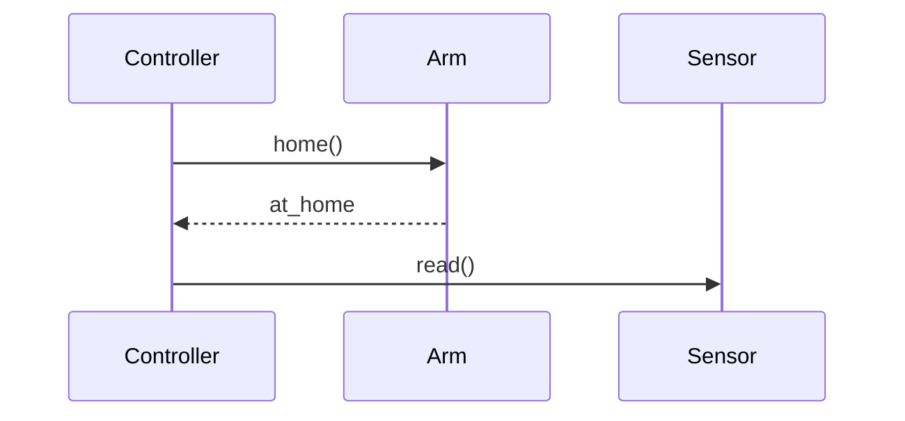

# Example output

A typical converted page looks like this (after `render_image()` is implemented):

```markdown
# Revive all wafer handling devices rev 4

## Overview

This procedure covers...

## Sequence diagram — recovery handshake


<!-- todo: img-002; ocr-confidence: 0.78 -->

**Caption:** Sequence: controller → arm → sensor
**Diagram source (mermaid):**

**OCR text:** Controller Arm Sensor home() at_home read()
```

The exact layout is decided by `render_image()` in `src/confluence_md/image_handler.py` —
see the docstring there. The orchestration around it (downloading attachments, running
OCR, populating the sidecar TODO file) is already done.

## Sidecar TODO file

For images with no extractable description, the sidecar file looks like:

```markdown
# TODO — diagrams needing description

Page: Revive all wafer handling devices rev 4

## img-005 — handsketch_v1.jpeg

OCR hint: 'L1 L2 R1 R2'

_Describe this diagram in 1-3 sentences and replace the corresponding HTML comment in the main .md file._
```
