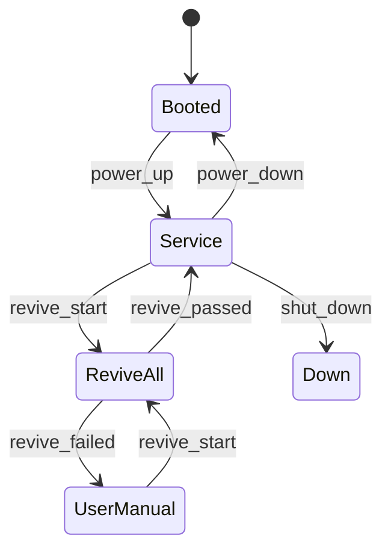

# Revive all wafer handling devices rev 4

Requirement divided to next steps :

**Comment :** Need to add a complete flow for Revive All wafer handling from UX ( User interface ) Side.

#### A10 Domains :

**Comment :** Add a case when FI Pulling info from Platform and we lost communication. What should happened then.

- In General FI Server will pull data from platform server but platform will not pull data from FI. So it means that FI Server will "Control" Platform in case of an error.


<!-- todo: img-001 -->

**Caption:** A10 domains and FI/Platform control direction

#### REQ 001 - Safety flag

**General description**

Safety flag ( Safety state) will be turn to true according to error definitions below at **REQ 003.**

Once this safety flag is turned to True System will move to "Halted" state per state machine.

> **Info:** FIFA will own only "FI Wafer Safety Application" — other states will be handled and developed by Infra team.


<!-- todo: img-002 -->

#### REQ 002 - FI Wafer Safety application state machine

FIFA SW will act according to state machine at "FI Wafer Safety Application".



**Tool State Transitions**

| Current State | Event | Actions | Next State |
| --- | --- | --- | --- |
| Error Type | User Manual Operation Error | Tool-busy token is released | User Manual Operation |
| Revive All wafer handling | Revive failed | Tool-busy token is released | User Manual Operation |
| User Manual Operation | Revive Start | Tool starts to perform Revive All wafer Handling. Tool Busy Token is taken. | Revive All wafer Handling |

#### REQ 003 - Consistent Wafer unload option

Revive All wafer Handling devices will include Emergency Unload that will be triggered upon certain conditions.

> **Warning:** Failure at unload will cause failure of Revive All wafer Handling devices. System will still be left at the same state per state machine.


<!-- todo: img-003 -->

**Caption:** Emergency unload — sequence with operator confirmation

#### REQ 004 — Error Activating Recovery flow

Error definitions that will activate "Safety Flag" = True. To Recover "Safety Flag" will require Revive Wafer handling devices.

```python
def evaluate_safety(error: WaferError) -> bool:
    if error.category in {"HW_FATAL", "WAFER_AT_RISK", "REVIVE_REQUIRED"}:
        return True
    return False
```

Diagrams below were drawn in draw.io — the macro is detected but the source XML lives in a separate attachment that v0.1 does not yet decode.


<!-- todo: img-004 -->
